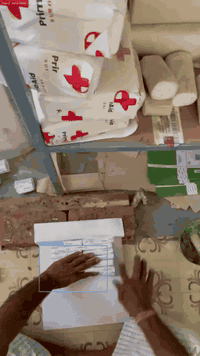
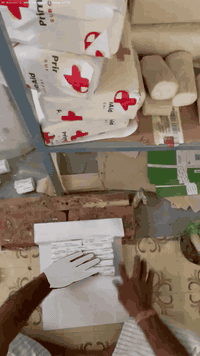
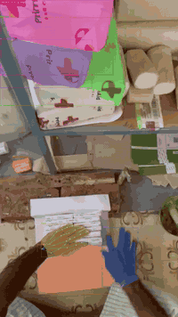
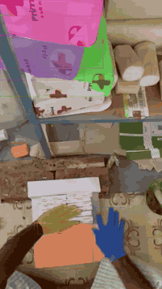
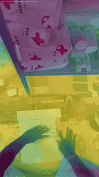
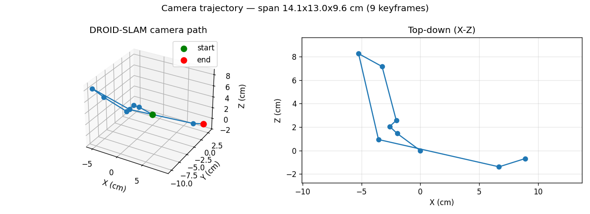
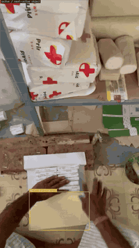
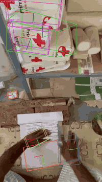
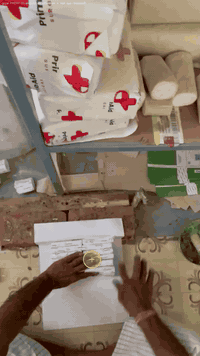
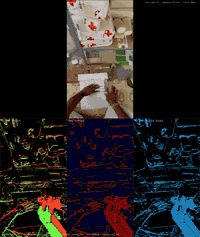

# XP Egocentric Annotation

**XP Robotics** — a 10-stage perception & annotation pipeline for **egocentric
(head/body-worn) RGB video**. Each input clip is turned into hands, objects, depth,
interaction labels, 6DoF poses, camera motion, and a neuromorphic event view — with
per-frame structured data (JSON) for every stage.

> This is the **`master`** branch: **code + per-scene outputs**.
> Client-facing outputs live on the **`main`** branch.

---

## The stack

<table>
  <tr>
    <td width="33%" align="center"><b>01 · Hand Detection + L/R</b><br></td>
    <td width="33%" align="center"><b>02 · 3D Hand Mesh (HaMeR)</b><br></td>
    <td width="33%" align="center"><b>03 · Hand Tracking</b><br></td>
  </tr>
  <tr>
    <td align="center"><b>04 · Object Segmentation</b><br></td>
    <td align="center"><b>05 · Metric Depth</b><br></td>
    <td align="center"><b>06 · Camera Trajectory</b><br></td>
  </tr>
  <tr>
    <td align="center"><b>07 · Active / Next-Active Object</b><br></td>
    <td align="center"><b>08 · Object 6DoF Pose</b><br></td>
    <td align="center"><b>09 · Gaze (attention proxy)</b><br></td>
  </tr>
  <tr>
    <td colspan="3" align="center"><b>10 · NeuroDepth — neuromorphic event vision</b><br></td>
  </tr>
</table>

| # | Stage | Model |
|---|---|---|
| 01 | Hand detection + side (L/R) | YOLO / WiLoR-family |
| 02 | 3D hand mesh (MANO) | HaMeR |
| 03 | Hand tracking over time | SAM 2 + HaMeR + temporal smoothing |
| 04 | Object segmentation (open-vocab) | SAM 3.1 / Grounded-SAM |
| 05 | Metric depth | MoGe-2 + Depth Anything V2 (+ HITNet stereo) |
| 06 | Camera trajectory / egomotion | DROID-SLAM |
| 07 | Active / next-active object | 100DOH + hand-object contact geometry |
| 08 | Object 6DoF pose | mask+depth PCA (FoundationPose upgrade path) |
| 09 | Gaze | manipulation-attention proxy |
| 10 | NeuroDepth | simulated neuromorphic event camera |

---

## Repository layout

```
annotation/              ← pipeline CODE (per-stage implementation + docs)
│   ├── 01_hand_detection/ … 10_neurodepth/   (implementation/ + docs/)
│   ├── common/           mcap → rectified frames
│   ├── render_scene.sh   render all 10 stages for one clip
│   └── export_scene_data.py   per-scene JSON + meshes + tracking.json
│
annoatation_all/         ← per-scene OUTPUTS (one folder per input clip)
    └── <category>/<scene>/
        ├── 00_input.mp4  ·  tracking.json  ·  metrics.json
        ├── 01_hand_detection/   (mp4 + hand_detections.json)
        ├── 02_hand_mesh/        (mp4 + hand_meshes/*.obj)
        ├── … 10_neurodepth/
```

Each scene folder is self-contained: every stage has its **video + corresponding
JSON**, plus a consolidated `tracking.json` (per-frame hands + objects) and `metrics.json`.

---

## Running the pipeline

```bash
# 1. object-prompt + hand pipeline on a clip window -> pipeline_result.pkl.gz
bash run_clip_sam3.sh <artifact_dir> --no-resume
# 2. render all 10 stages + export data for that clip
bash annotation/render_scene.sh <scene> <pkl> <frames_dir> <input.mp4>
```

Model weights and heavy third-party repos (DROID-SLAM, HITNet, Depth-Anything-V2,
100DOH) are **not** committed — see [`SETUP.md`](SETUP.md) to fetch them.

---

<div align="center"><sub>© XP Robotics — egocentric annotation pipeline.</sub></div>
