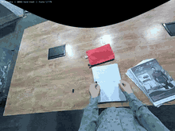
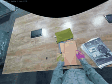
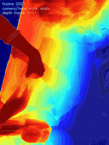
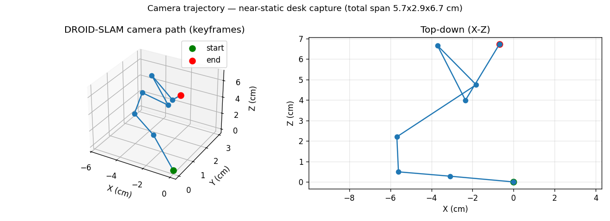
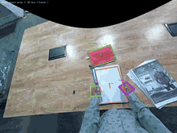
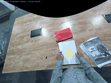
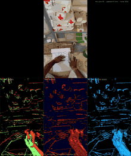

# Egocentric Video Perception — Hand · Object · Scene Understanding

**XP Robotics**

A complete perception stack for **egocentric (head/body-worn) RGB video** — turning
a raw wearable-camera clip into hands, objects, depth, interaction labels, 6DoF
poses, and camera motion, in one metric world frame.

📄 [Capability summary](CAPABILITY.md) &nbsp;·&nbsp; ✅ [Requirement coverage](REQUIREMENTS.md) &nbsp;·&nbsp; 🗂️ [Data format](DATA_FORMAT.md) &nbsp;·&nbsp; 📦 [`tracking.json`](tracking.json)

---

## Results — the full ego stack

<table>
  <tr>
    <td width="33%" align="center"><b>Hand Detection + L/R</b> both hands, side-labelled  </td>
    <td width="33%" align="center"><b>3D Hand Mesh</b> MANO, per frame  </td>
    <td width="33%" align="center"><b>Hand Tracking</b> 21-joint, temporally stable  </td>
  </tr>
  <tr>
    <td align="center"><b>Object Segmentation</b> open-vocabulary, text-prompted  </td>
    <td align="center"><b>Metric Depth</b> heatmap  </td>
    <td align="center"><b>Camera Trajectory</b> egomotion / SLAM  </td>
  </tr>
  <tr>
    <td align="center"><b>Active / Next-Active Object</b> hand-object contact  </td>
    <td align="center"><b>Object 6DoF Pose</b> oriented 3D box + axes  </td>
    <td align="center"><b>Gaze (attention proxy)</b> manipulation focus  </td>
  </tr>
</table>

**NeuroDepth — neuromorphic event vision** (simulated event camera: ON/OFF events, time surface, reconstructed edges)

Full-resolution MP4s live in each stage folder. Combined overview:
<a href="showcase_montage.jpg">showcase_montage.jpg</a>.

---

## What's in each folder

Every stage folder contains its **result videos** (MP4 + GIF), its **structured
data** (JSON / mesh / trajectory), and a one-page **`BRIEF.md`** describing the
capability, its inputs, and its outputs.

| # | Stage | Folder | Key deliverables |
|---|---|---|---|
| 01 | Hand detection + side (L/R) | [`01_hand_detection/`](01_hand_detection/) | video · `hand_detections.json` |
| 02 | 3D hand mesh (MANO) | [`02_hand_mesh_hamer/`](02_hand_mesh_hamer/) | video · `hand_meshes/` (per-frame `.obj`) |
| 03 | Hand tracking over time | [`03_hand_tracking/`](03_hand_tracking/) | video · `hand_tracks.json` (2D+3D) |
| 04 | Object segmentation (open-vocab) | [`04_object_segmentation/`](04_object_segmentation/) | video · `objects.json` · trajectory plot |
| 05 | Metric depth | [`05_depth_metric/`](05_depth_metric/) | monocular + **stereo** depth videos |
| 06 | Camera trajectory / egomotion | [`06_camera_trajectory/`](06_camera_trajectory/) | trajectory plot · `camera_poses.npy` |
| 07 | Active / next-active object | [`07_active_object/`](07_active_object/) | video · contact + active-object JSON |
| 08 | Object 6DoF pose | [`08_object_6dof_pose/`](08_object_6dof_pose/) | video · `object_6dof_poses.json` |
| 09 | Gaze (attention proxy) | [`09_gaze/`](09_gaze/) | video · `attention_proxy.json` |

A depth result on an **additional client clip** is included in
[`external_video_depth/`](external_video_depth/).

---

## Coordinate frame & units

Everything is in **metric metres**, in a **camera-centred** frame
(`+X` right, `+Y` down, `+Z` forward), consistent across the clip. Hands, objects,
depth, and poses share this single world frame. See per-stage `BRIEF.md` for the
exact schema of each JSON.

© XP Robotics — egocentric perception delivery.

