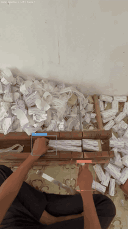
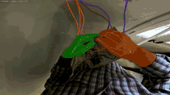
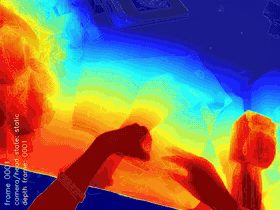
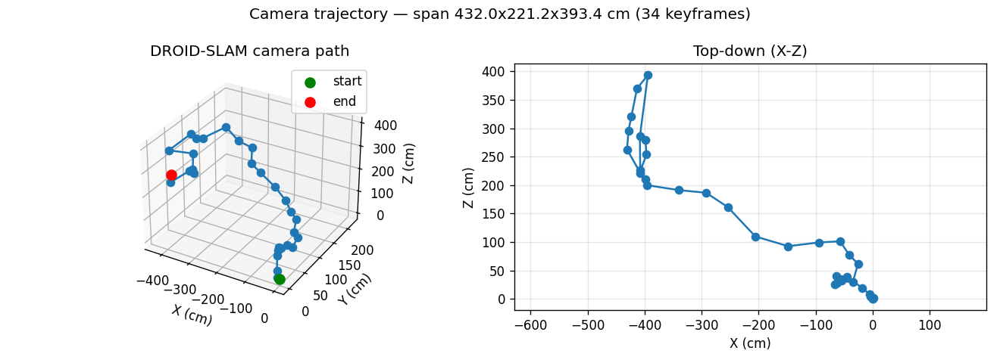
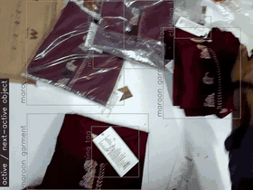
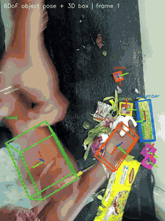
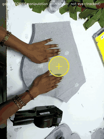
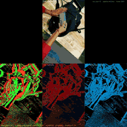

# Egocentric Video Perception — Hand · Object · Scene Understanding

**XP Robotics**

A complete perception stack for **egocentric (head/body-worn) RGB video** — turning
a raw wearable-camera clip into hands, objects, depth, interaction labels, 6DoF
poses, and camera motion, in one metric world frame.

📄 [Capability summary](CAPABILITY.md) &nbsp;·&nbsp; ✅ [Requirement coverage](REQUIREMENTS.md) &nbsp;·&nbsp; 🗂️ [Data format](DATA_FORMAT.md) &nbsp;·&nbsp; 📦 [`tracking.json`](tracking.json)

---

## Results — one stage per scene

The stack runs across many everyday egocentric scenes. Each panel below is a
**different stage** shown on a **different real scene** — demonstrating the same
pipeline generalising across healthcare, industrial, office and household tasks.

<table>
  <tr>
    <td width="33%" align="center"><b>01 · Hand Detection + L/R</b> healthcare · bandage rolls  </td>
    <td width="33%" align="center"><b>02 · 3D Hand Mesh (MANO)</b> maintenance · plumbing  </td>
    <td width="33%" align="center"><b>03 · Hand Tracking</b> industrial · electrician  </td>
  </tr>
  <tr>
    <td align="center"><b>04 · Object Segmentation</b> office · open-vocab  </td>
    <td align="center"><b>05 · Metric Depth</b> tailoring · fabric heatmap  </td>
    <td align="center"><b>06 · Camera Trajectory</b> household · room organising  </td>
  </tr>
  <tr>
    <td align="center"><b>07 · Active / Next-Active Object</b> fold-cloth packing  </td>
    <td align="center"><b>08 · Object 6DoF Pose</b> cleaning kitchen slab  </td>
    <td align="center"><b>09 · Gaze (attention proxy)</b> sticker-in-cloth  </td>
  </tr>
</table>

**10 · NeuroDepth — neuromorphic event vision** &nbsp;(office-data scene)
 ON/OFF events · time surface · reconstructed edges

Full-resolution MP4s + per-frame JSON for <b>every</b> scene live in each stage folder.

---

## What's in each folder

Every stage folder contains its **result videos** (MP4 + GIF), its **structured
data** (JSON / mesh / trajectory), and a one-page **`BRIEF.md`** describing the
capability, its inputs, and its outputs.

| # | Stage | Folder | Key deliverables |
|---|---|---|---|
| 01 | Hand detection + side (L/R) | [`01_hand_detection/`](01_hand_detection/) | video · `hand_detections.json` |
| 02 | 3D hand mesh (MANO) | [`02_hand_mesh_hamer/`](02_hand_mesh_hamer/) | video · `hand_meshes/` (per-frame `.obj`) |
| 03 | Hand tracking over time | [`03_hand_tracking/`](03_hand_tracking/) | video · `hand_tracks.json` (2D+3D) |
| 04 | Object segmentation (open-vocab) | [`04_object_segmentation/`](04_object_segmentation/) | video · `objects.json` · trajectory plot |
| 05 | Metric depth | [`05_depth_metric/`](05_depth_metric/) | monocular + **stereo** depth videos |
| 06 | Camera trajectory / egomotion | [`06_camera_trajectory/`](06_camera_trajectory/) | trajectory plot · `camera_poses.npy` |
| 07 | Active / next-active object | [`07_active_object/`](07_active_object/) | video · contact + active-object JSON |
| 08 | Object 6DoF pose | [`08_object_6dof_pose/`](08_object_6dof_pose/) | video · `object_6dof_poses.json` |
| 09 | Gaze (attention proxy) | [`09_gaze/`](09_gaze/) | video · `attention_proxy.json` |

A depth result on an **additional client clip** is included in
[`external_video_depth/`](external_video_depth/).

---

## Coordinate frame & units

Everything is in **metric metres**, in a **camera-centred** frame
(`+X` right, `+Y` down, `+Z` forward), consistent across the clip. Hands, objects,
depth, and poses share this single world frame. See per-stage `BRIEF.md` for the
exact schema of each JSON.

© XP Robotics — egocentric perception delivery.

